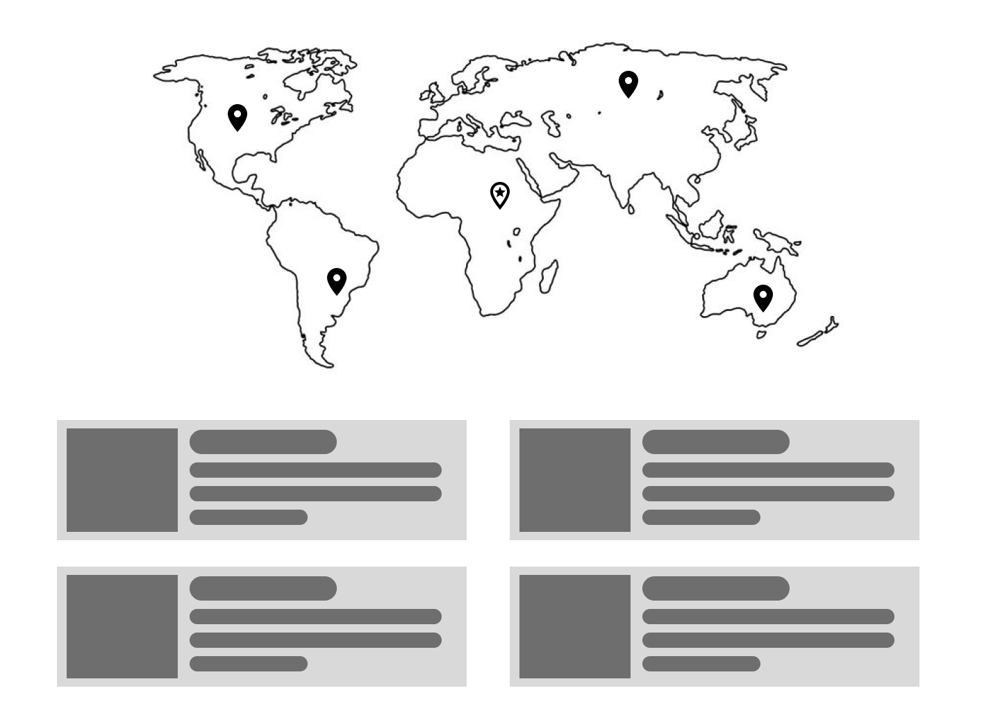

# Star Wars - Rebellion. The Frontend interview assignment.
## Story

Grundium lab personnel, using cutting-edge imaging and AI technology they possess, have recently intercepted an encoded message from a galaxy far, far away. The packet contains some meaningless gibberish, but considering the origins of the message, we suspect it should contain some valuable information addressed to the Rebel Army faction present on our planet, perhaps location coordinates and identities of some key political characters hiding somewhere on planet Earth? The answer is, "we don't know". Sadly, we don't have enough engineers to decode the message, make sense of it and implement the ***Locator*** application. This is where your part in the story begins 😄.

## Making sense of the message

Your task is to first decode the message, encrypted contents can be found in [secret.json](data/secret.json), try to guess or ask around about the decryption key, you are smarty pants here, so it should not be that hard after all 😂!

Depending on the message content:

1. If the Galactic Empire is planning to conquer and oppress the people of planet Earth any time soon, please DM [Bruce Willis](https://twitter.com/brucewilliswb) immediately, he knows how to handle this type of situation. Abort the task and enjoy your freedom while you still can 🤣.

2. If you find a list of coordinates and identities of Rebellion's key members as we expect you to, please continue reading and proceed with the implementation of the ***Locator*** application. 

## Locator application overview

This is a single page application, where user can immediately see the map of the world (planet Earth), covered with markers of the secret locations you decrypted from the [secret.json](data/secret.json). The user should also be able to set their own location by clicking on the map. When the user location is set, a list should appear; each item on the list corresponds to a location, and should render the data available for the entity which awaits
on that location, in addition to the distance from the user to the entity. The list should be sorted from closest to farthest. Just to make things a little simpler, you can reference the following UI wireframe example, but as long as the required functionality is there, feel free to change anything:


## Data sources

### Encrypted message

The secret message should be fetched from an API and decrypted in the browser upon receipt:

```http request
GET https://aseevia.github.io/star-wars-frontend/data/secret.json
```

Once you decrypt coordinates and identities, you will probably end up with a data structure similar to this:

```json
...
{
  ...
  "id": 4,                   // ID of the entity
  "lat": -33.85664180722481, // geographical latitude
  "long": 151.2153396118792, // geographical longitude
  ...
},
{ ... },
{ ... },
...
```

Where "lat" and "long" correspond to geographical latitudes and longitudes respectively, and the ***id*** should be usable for extracting additional information about entities. 

### Information about the entities

It should be possible to fetch data about the entities from the following API:
```http request
GET https://akabab.github.io/starwars-api/api/id/<id>.json
```

Example for ID=4 : 
```http request
GET https://akabab.github.io/starwars-api/api/id/4.json
```

The data structure of entity details looks like:

```json
{
  "id": 4,
  "name": "Darth Vader",
  "height": 2.03,
  "mass": 120,
  "gender": "male",
  "homeworld": "tatooine",
  "wiki": "http://starwars.wikia.com/wiki/Anakin_Skywalker",
  "image": "https://vignette.wikia.nocookie.net/fr.starwars/images/3/32/Dark_Vador.jpg",
  "born": -41,
  "died": 4,
  "diedLocation": "death star ii, endor system",
  "species": "human",
  "hairColor": "blond",
  "eyeColor": "blue, yellow (dark side)",
  "skinColor": "light, later pale",
  "cybernetics": "Cybernetic right arm; later prosthetic arms and legs, and a life-support system",
  "affiliations": [
    "501st Legion",
    "Sith",
    "Galactic Empire",
    "Imperial High Command"
  ],
  "masters": [
    "Qui-Gon Jinn (informal Jedi Master)",
    "Obi-Wan Kenobi (Jedi Master)",
    "Darth Sidious (Sith Master)",
    "Yoda (Force spirit teacher)"
  ],
  "apprentices": [
    "Ahsoka Tano (Padawan)",
    "Inquisitorius"
  ],
  "formerAffiliations": [
    "Jedi Order",
    "Jedi High Council",
    "Galactic Republic"
  ]
}
```

## Requirements

1. The main front-end technology is to be selected from: Angular, React, or React frameworks, e.g., Gatsby or Next.js
2. The amount of details to render for each entity is up to you (name and avatar sould be there at least).
3. Make it look nice, try to match the theme of the app and the content, but don't go over the top (don't spend more than a few hours)
4. Make informed decisions. Use what you think is suitable for e.g., state management, making HTTP requests, rendering the map.
5. This is a great opportunity to express your creativity, so make sure the app reflects your strengths, for example:
  - Make it look super nice visually if you are a graphical designer at heart, and we may forgive you for the messy code 😄.
  - TDD adept? Cover it with tests thoroughly, we won't care if it comes out ugly in this case 😂.
  - Frontend architect? Surprise us with the project structure and architectural decisions, make Uncle Bob proud of you 👍!
  - Have any other superpower(s)? Now is the time to show them off!

## Delivering the result
Create a GitHub repository for your solution, make a live demo available (GitHub pages, Vercel, Netlify), and send us links to both source repository and the deployed app.
And don't forget to give a star to this repository if you've had fun implementing the App!
